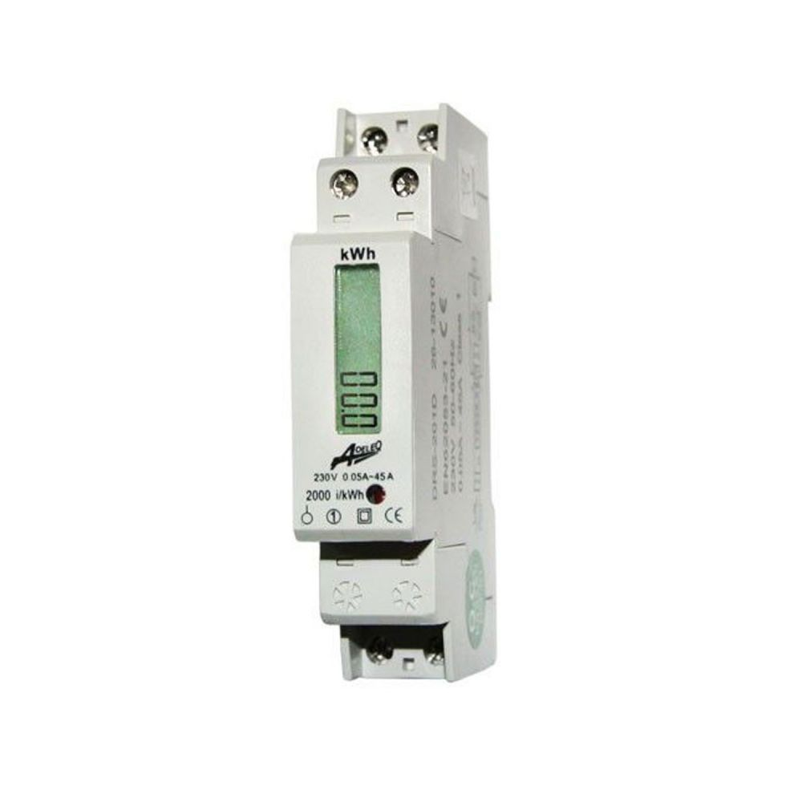
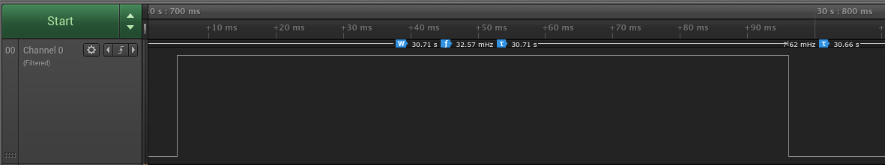
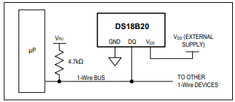
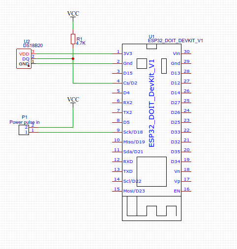
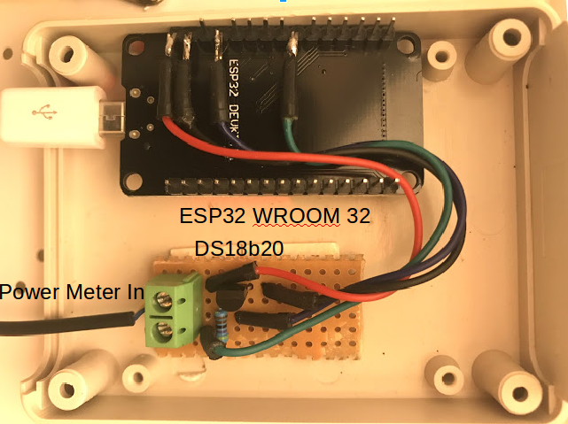
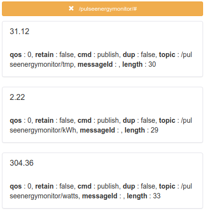

# Power Meter with mqtt-for devices with pulse output


##About

 This project presents a simple solution for measureing the energy consumption of a house. The key element is a cheap energy monitor with pulse output, connected to an [ESP32 WROOM 32 board](https://docs.espressif.com/projects/esp-idf/en/latest/hw-reference/modules-and-boards.html#esp-modules-and-boards-esp32-wroom-32). This, over WiFi using mqtt protocol can be easely connected to a home automation system to report:
- instant power (in Watts);
- total power consumption (in kWh);
- Device temperature (in Celsius) using a DS18b20 temperature sensor.

## Hardware Components

### ESP 32 board
[ESP32 WROOM 32 board](https://docs.espressif.com/projects/esp-idf/en/latest/hw-reference/modules-and-boards.html#esp-modules-and-boards-esp32-wroom-32)

### The Power Meter

The power meter [adeleq_02-553_DIG](https://www.dedeman.ro/ro/contor-monofazic-digital-45a-1m-02-553/dig/p/1030357) operating range is 0.05A-45A, and (the most important part) provide 2000 impulses / kWh. Emitted pulses for detections have ~90 ms pulse width. The outpus is open collector, operateing voltage, from 5-24V. In this case the ESP32 supply provides 3.3V, but this is not a limitation. Other variants are available on the market, usually the diffrence is the accuracy (i.e. pulses / kWh are only 1000 instead of 2000). 

<h1 align="center">
  <a name="Pulse Output" href=""></a>
</h1>
Below a sample picture for the output, where a light bulb (~53W) is connected to the power meter.
Measured pulse between two detections is about 30.71s, which leads to a value measured of ~58.61 Watts.

```
Conversion from kWh to Watts, measured with a sensor of 2000 pulses/ kWh:
(<kilo Watt to Watt>*<Hour in secounds>/<impuse number>)/<time measured between pulses> 
=>(1000*3600/2000)/31.71 => 58.71W
```

<h1 align="center">
  <a name="Pulse Output" href=""></a>
</h1>
### The temperature sensor
[DS18b20](https://datasheets.maximintegrated.com/en/ds/DS18B20.pdf) is a fast digital termometer using 1-Wire protocol. Usual connection diagramm is with an 4.7 kOhm pull-up resistor.

<h1 align="left">
  <a name="Pulse Output" href=""></a>
</h1>
### Connection diagramm

Below the wiring diagramm, made with [Easyeda](https://easyeda.com/) tool. 
<h1 align="center">
  <a name="Pulse Output" href=""></a>
</h1>


### Final integration
<h1 align="left">
  <a name="Pulse Output" href=""></a>
</h1>

#How to use

Clone the repository, update the .ino file in [Arduino IDE](https://www.arduino.cc/en/main/software) with your local WiFi / mqtt configuration.

```
/*mqtt declarations*/
const char* mqtt_server = "<IP OF THE MQTT SERVER>";
const char* mqtt_user = "<USER NAME>";
const char* mqtt_password = "<PASSWORD>";
...
/* SSID and Password of WiFi router */
const char* ssid = "<ROUTER SSID>";
const char* password = "<ROUTER PASSWORD>";
```

 Upload the code in the [ESP32 WROOM 32 board](https://docs.espressif.com/projects/esp-idf/en/latest/hw-reference/modules-and-boards.html#esp-modules-and-boards-esp32-wroom-32) over USB, wire the board accordingly to the schematics. The output will be something similar on the mqtt topics:
<h1 align="left">
<a name="Pulse Output" href=""></a>
</h1>

/Enjoy.
